# Relatório - Trabalho sobre PGP

## 1. Criação do Certificado PGP

### Instalação do GnuPG
Primeiro, foi necessário instalar o GnuPG no sistema operacional macOS usando o gerenciador de pacotes Homebrew [4]:

```bash
brew install gnupg
```

### Geração do Par de Chaves
Após a instalação, utilizei o comando abaixo para iniciar o processo de geração de chaves [4]:

```bash
gpg --full-generate-key
```

Durante o processo interativo:
1. Selecionei o tipo de chave padrão (RSA and RSA)
2. Defini o tamanho da chave como 3072 bits
3. Configurei um período de validade de 90 dias
4. Inseri as seguintes informações pessoais:
   - Nome: Joao Cordeiro
   - E-mail: jschmidtcordeiro@gmail.com
   - Comentário: Reach out at @cordeiro05 on Instagram or jschmidtcordeiro on GitHub
5. Criei uma senha forte para proteger a chave privada

### Backup da Chave Privada
Criei um diretório de backup e exportei a chave privada:

```bash
mkdir -p "4 - Trabalho sobre PGP/backup"
gpg --export-secret-keys --armor 5BD7096F81478AA33F6CB0B4155B13B98FE2E6C8 > "4 - Trabalho sobre PGP/backup/private_key_backup.asc"
```

### Exportação da Chave Pública
Exportei a chave pública para um arquivo separado:

```bash
gpg --export --armor 5BD7096F81478AA33F6CB0B4155B13B98FE2E6C8 > "4 - Trabalho sobre PGP/backup/public_key.asc"
```

### Publicação no Repositório PGP
Publiquei a chave pública no servidor de chaves do Ubuntu:

```bash
gpg --keyserver keyserver.ubuntu.com --send-key 5BD7096F81478AA33F6CB0B4155B13B98FE2E6C8
```

### Verificação da Publicação
Para verificar se a chave foi publicada com sucesso, executei:

```bash
gpg --keyserver keyserver.ubuntu.com --recv-keys 5BD7096F81478AA33F6CB0B4155B13B98FE2E6C8
```

A resposta confirmou que a chave está presente no servidor.

### Informações da Chave
- **ID da Chave**: 5BD7096F81478AA33F6CB0B4155B13B98FE2E6C8
- **Tipo**: RSA 3072 bits
- **Data de Criação**: 6 de maio de 2025
- **Data de Expiração**: 4 de agosto de 2025
- **URL para Verificação**: https://keyserver.ubuntu.com/pks/lookup?search=0x5BD7096F81478AA33F6CB0B4155B13B98FE2E6C8&fingerprint=on&op=index

### Observações Importantes
1. A chave privada foi armazenada de forma segura
2. A senha da chave privada foi memorizada
3. O ID da chave deve ser usado para todas as operações futuras

### Experimentos:

#### 1. Criptografia de Mensagem
Realizei a criptografia de uma imagem para o colega Enzo utilizando sua chave pública:

```bash
# Importação da chave pública do Enzo
gpg --keyserver keyserver.ubuntu.com --recv-keys 24B83FFEA53408DA

# Criptografia da imagem
gpg --encrypt --recipient 24B83FFEA53408DA cordeiro.jpg --output enzote_criptografado.jpg
```

#### 2. Assinatura de Mensagem
Criei uma assinatura da imagem utilizando minha chave privada:

```bash
# Assinatura da imagem
gpg --sign cordeiro.jpg
```

#### 3. Assinatura Detached
Gerei uma assinatura separada (detached) da imagem:

```bash
# Criação da assinatura detached
gpg --detach-sign cordeiro.jpg
```
Isso gerou o arquivo `cordeiro.jpg.sig` contendo apenas a assinatura.

#### 4. Assinatura com Arquivo Original
Criei uma versão da imagem que inclui tanto o arquivo original quanto a assinatura:

```bash
# Assinatura com o arquivo original
gpg --sign cordeiro.jpg
```
Isso gerou o arquivo `cordeiro.jpg.gpg` que contém a imagem original e a assinatura.

#### Resultados dos Experimentos
1. A imagem criptografada (`enzote_criptografado.jpg`) só pode ser aberta pelo Enzo usando sua chave privada
2. A assinatura detached (`cordeiro.jpg.sig`) permite verificar a autenticidade da imagem original
3. O arquivo assinado (`cordeiro.jpg.gpg`) contém tanto a imagem quanto a assinatura em um único arquivo
4. Todas as operações foram realizadas com sucesso, demonstrando o funcionamento correto do PGP para criptografia e assinatura digital [2]

## 2. Revogação de Certificados

### Criação de um Novo Certificado PGP
Para realizar o experimento de revogação, criarei um novo certificado PGP específico para teste [2]:

```bash
gpg --full-generate-key
```

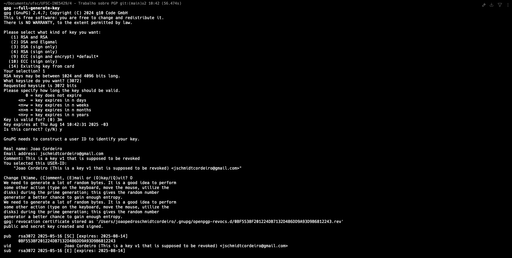

Durante o processo interativo:
1. Selecionarei o tipo de chave RSA and RSA (default)
2. Definirei o tamanho da chave como 3072 bits
3. Configurarei um período de validade de 90 dias
4. Inserirei as seguintes informações:
   - Nome: Joao Cordeiro
   - E-mail: jschmidtcordeiro@gmail.com
   - Comentário: This is a key v1 that is supposed to be revoked

### Publicação no Servidor PGP
Após criar o certificado, publicarei a chave pública no servidor de chaves do Ubuntu:

```bash
# Obtenho o ID da chave gerada
gpg --list-keys jschmidtcordeiro@gmail.com

# Publico a chave no servidor
gpg --keyserver keyserver.ubuntu.com --send-key 0BF5538F201224DB7132D486DD9A93D9B6812243
```

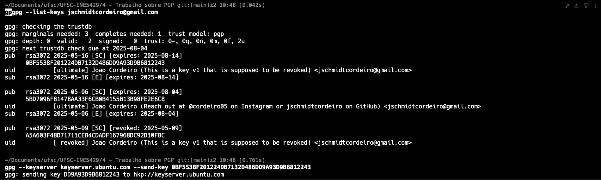

### Verificação do Status da Chave
Para verificar se a chave foi publicada com sucesso:

```bash
# Atualizo o chaveiro local com informações do servidor
gpg --keyserver keyserver.ubuntu.com --refresh-keys

# Verifico o status da chave específica
gpg --keyserver keyserver.ubuntu.com --recv-keys 0BF5538F201224DB7132D486DD9A93D9B6812243
```

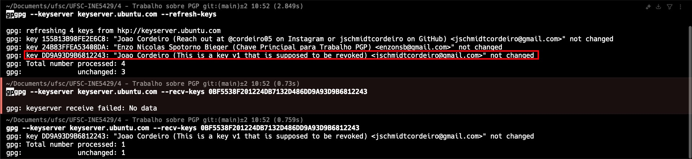

### Criação do Certificado de Revogação
Agora, criarei um certificado de revogação para a chave [3]:

```bash
# Gero o certificado de revogação
gpg --output revocation_cert.asc --gen-revoke 0BF5538F201224DB7132D486DD9A93D9B6812243
```

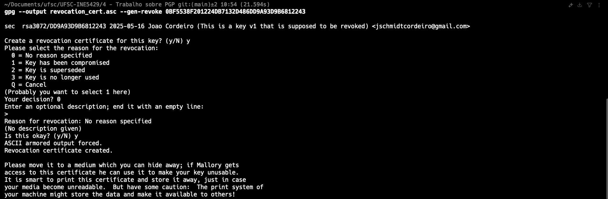

Durante o processo interativo:
1. Confirmarei a criação do certificado de revogação
2. Selecionarei o motivo da revogação (0 = Sem motivo específico)
3. Adicionarei uma descrição (nesse caso, foi adicionado uma descrição vazia)
4. Confirmarei a criação do certificado

### Revogação do Certificado
Com o certificado de revogação gerado, procederei à revogação da chave [3]:

```bash
# Importo o certificado de revogação para o chaveiro local
gpg --import revocation_cert.asc

# Envio a chave revogada para o servidor
gpg --keyserver keyserver.ubuntu.com --send-key 0BF5538F201224DB7132D486DD9A93D9B6812243
```

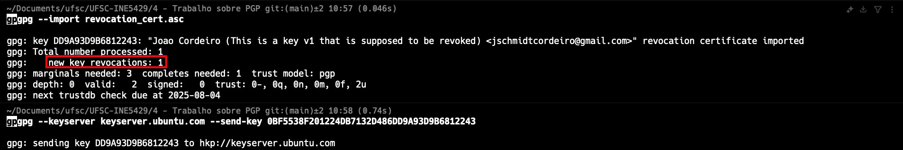

### Verificação da Revogação
Para confirmar que a chave foi revogada com sucesso:

```bash
# Atualizo o chaveiro local
gpg --keyserver keyserver.ubuntu.com --refresh-keys

# Verifico o status da chave
gpg --list-keys jschmidtcordeiro@gmail.com
```

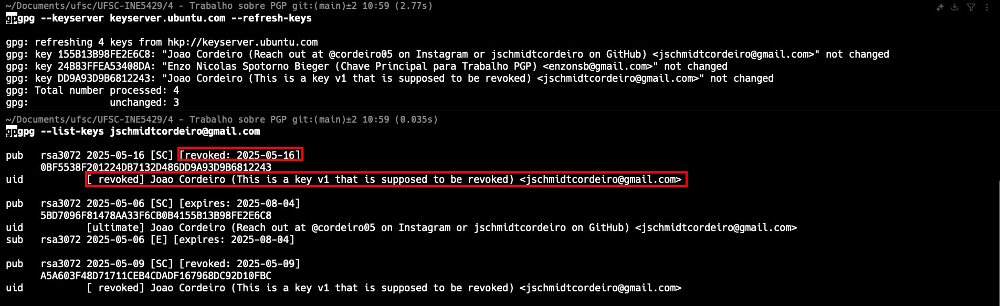

A saída deve indicar que a chave foi revogada, geralmente com uma marcação como "rev" ou "revoked".

### Resultados do Experimento

Os resultados de cada comando dos experimentos estão disponíveis nas capturas de tela em suas respectivas seções, visando a facilidade de visualização e comparação. Abaixo se encontram as informações principais sobre o certificado revogado.

**KeyID do certificado revogado**: 0BF5538F201224DB7132D486DD9A93D9B6812243
**Data da criação**: 16 de maio de 2025
**Data da revogação**: 16 de maio de 2025

## 3. Revogação de Assinaturas

### Localização de um Certificado para Assinar
Primeiramente, preciso localizar um certificado PGP de outra pessoa para assinar [1]:

```bash
# Busco por certificados PGP que o Enzo Nicolas publicou no forum da disciplina
gpg --keyserver keyserver.ubuntu.com --recv-keys 24B83FFEA53408DA
```


### Verificação do Certificado
Antes de assinar, verificarei as informações do certificado:

```bash
# Listo as chaves importadas para identificar a que desejo assinar
gpg --list-keys

# Exibo informações detalhadas sobre o certificado escolhido
gpg --fingerprint 4DE77B25F1F28B9F7A5BFB3E24B83FFEA53408DA
```

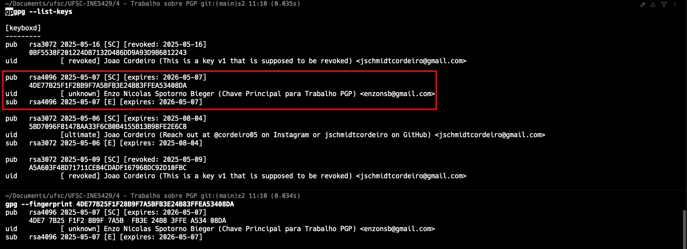

### Assinatura do Certificado
Após verificar a identidade do proprietário do certificado, procederei com a assinatura [1]:

```bash
# Assino o certificado
gpg --sign-key 4DE77B25F1F28B9F7A5BFB3E24B83FFEA53408DA
```

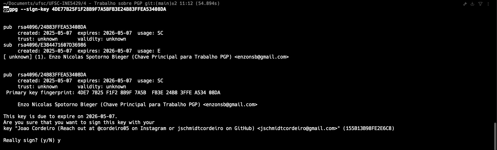

Durante o processo interativo:
1. Confirmarei a assinatura do certificado

### Envio da Assinatura para o Servidor PGP
Após assinar o certificado, enviarei a chave atualizada para o servidor de chaves:

```bash
# Envio o certificado assinado para o servidor
gpg --keyserver keyserver.ubuntu.com --send-key 4DE77B25F1F28B9F7A5BFB3E24B83FFEA53408DA
```


### Verificação da Assinatura
Para confirmar que a assinatura foi publicada com sucesso:

```bash
# Atualizo meu chaveiro local com as informações do servidor
gpg --keyserver keyserver.ubuntu.com --refresh-keys

# Verifico o certificado para confirmar minha assinatura
gpg --check-signatures 4DE77B25F1F28B9F7A5BFB3E24B83FFEA53408DA
```

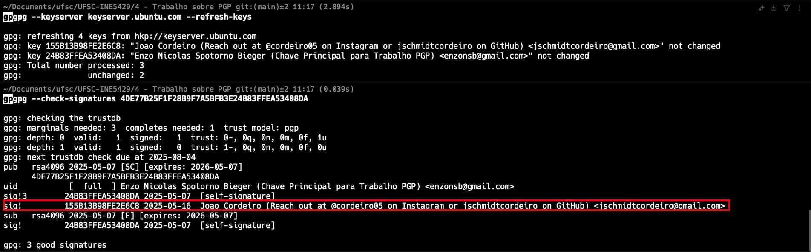

A saída deve mostrar minha assinatura associada ao certificado.

### Revogação da Assinatura
Agora, procederei com a revogação da assinatura que fiz [3]:

```bash
# Revogo minha assinatura do certificado (processo interativo)
gpg --local-user 5BD7096F81478AA33F6CB0B4155B13B98FE2E6C8 --edit-key 4DE77B25F1F28B9F7A5BFB3E24B83FFEA53408DA
```

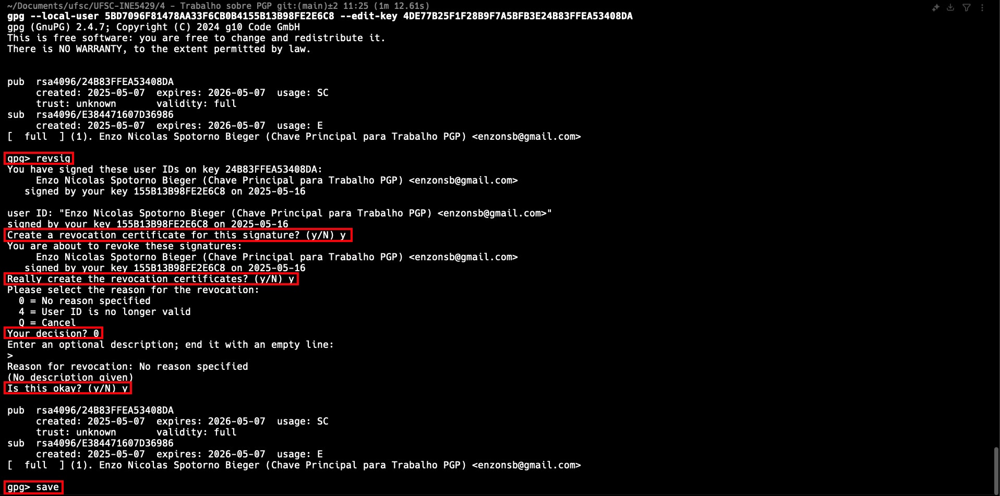

Durante o processo interativo:
1. No prompt do GPG, digitarei `revsig`
2. Selecionarei o ID de usuário correspondente (geralmente 1)
3. Confirmarei a revogação quando solicitado
4. Escolherei um motivo para a revogação (0-3)
5. Fornecerei uma descrição opcional se necessário
6. Digitarei `save` para salvar as alterações e sair

### Envio da Revogação para o Servidor
Após revogar a assinatura, enviarei a chave atualizada para o servidor:

```bash
# Envio o certificado com a assinatura revogada para o servidor
gpg --keyserver keyserver.ubuntu.com --send-key 4DE77B25F1F28B9F7A5BFB3E24B83FFEA53408DA
```


### Verificação da Revogação
Para confirmar que a revogação da assinatura foi processada com sucesso:

```bash
# Atualizo meu chaveiro local
gpg --keyserver keyserver.ubuntu.com --refresh-keys

# Verifico o certificado para confirmar a revogação da assinatura
gpg --check-signatures 4DE77B25F1F28B9F7A5BFB3E24B83FFEA53408DA
```

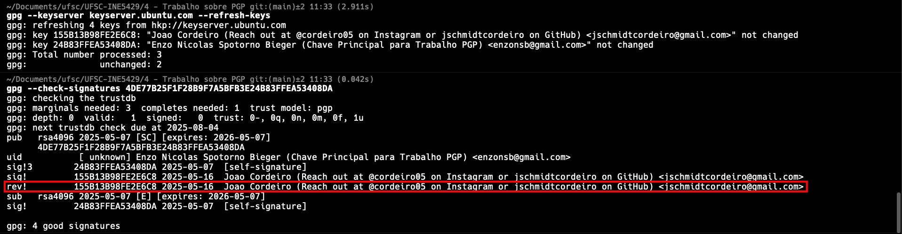

A saída deve mostrar minha assinatura como revogada.

### Resultados do Experimento

Os resultados de cada comando dos experimentos estão disponíveis nas capturas de tela em suas respectivas seções, visando a facilidade de visualização e comparação. Abaixo se encontram as informações principais sobre a assinatura revogada.

**KeyID do certificado cuja assinatura foi revogada**: 4DE77B25F1F28B9F7A5BFB3E24B83FFEA53408DA
**Data da assinatura**: 16 de maio de 2025
**Data da revogação da assinatura**: 16 de maio de 2025

## Resposta às perguntas:

### 4) O que é o anel de chaves privadas? Como este está estruturado? Na sua aplicação PGP onde este anel de chaves é armazenado? Quem pode ser acesso a esse porta chaves?

O anel de chaves privadas (private keyring) é uma estrutura de dados que armazena as chaves privadas do usuário no sistema PGP/GPG. Diferente do anel de chaves públicas, esse repositório contém material criptográfico altamente sensível que deve ser protegido [5].

**Estrutura do anel de chaves privadas:**
- Cada entrada no anel de chaves contém uma chave privada principal e possivelmente várias subchaves.
- Cada chave privada armazenada inclui:
  - A chave privada em si (material criptográfico para decriptação/assinatura)
  - Identificadores de usuário associados (nome, email, comentário)
  - Data de criação e expiração
  - Flags de uso (assinatura, criptografia, autenticação)
  - Informações de preferências criptográficas
  - O material criptográfico é armazenado de forma protegida, geralmente usando criptografia simétrica com uma senha como chave.

**Localização do armazenamento no GnuPG:**
- Nas versões modernas do GnuPG (2.1+), o anel de chaves privadas é armazenado no diretório `~/.gnupg/private-keys-v1.d/` como arquivos individuais para cada chave [5].
- Em versões mais antigas (GnuPG 1.x), as chaves privadas eram armazenadas em um único arquivo chamado `secring.gpg` no diretório `~/.gnupg/` [4].
- No macOS (que estou usando), esse diretório está localizado em `/Users/joaopedroschmidtcordeiro/.gnupg/`.


**Proteção e acesso:**
- O acesso ao anel de chaves privadas é restrito apenas ao proprietário da chave.
- A proteção ocorre em dois níveis:
  1. **Proteção no sistema de arquivos**: O diretório e os arquivos têm permissões restritas (geralmente 600 ou 700, que permitem acesso somente ao proprietário).
  2. **Proteção criptográfica**: Cada chave privada é criptografada com uma senha definida pelo usuário. Essa senha é necessária para qualquer operação que utilize a chave privada.
- Apenas o proprietário do diretório `~/.gnupg/` pode acessar os arquivos de chave privada, desde que mantenha as permissões de arquivo adequadas.
- Mesmo tendo acesso aos arquivos, um atacante ainda precisaria da senha para usar as chaves privadas.
- O GPG Agent gerencia o cache temporário de senhas, permitindo que operações subsequentes sejam realizadas sem digitar a senha repetidamente dentro de um período configurável.

**Exemplo de permissões do anel de chaves privadas do meu sistema:**

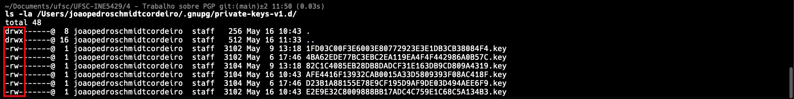

Por essas razões, é crucial manter a segurança do sistema operacional, usar senhas fortes para proteger as chaves privadas e considerar o uso de hardware tokens (como YubiKey) para armazenar as chaves privadas em dispositivos físicos separados para maior segurança [2].

### 5) Qual a diferença entre assinar uma chave local e assinar no servidor?

**Assinatura local (não exportada):**
- A assinatura é armazenada apenas no chaveiro local do signatário
- É criada usando o comando `gpg --lsign-key ID_DA_CHAVE` ou usando a opção de assinatura local no modo interativo
- Não é enviada automaticamente para servidores de chaves públicos
- É visível apenas para o signatário e qualquer pessoa com acesso ao seu chaveiro local
- Útil para validar chaves para uso pessoal sem fazer uma declaração pública de confiança
- Não contribui para a Web of Trust global do PGP [6]

**Assinatura em servidor (exportada/pública):**
- A assinatura é criada localmente e depois enviada a servidores de chaves públicos
- É criada usando `gpg --sign-key ID_DA_CHAVE` e depois enviada com `gpg --send-key ID_DA_CHAVE`
- Torna-se disponível publicamente para qualquer pessoa que consulte a chave nos servidores
- Serve como uma declaração pública de que você verificou a identidade do proprietário da chave
- Contribui para a Web of Trust do PGP, ajudando outras pessoas a avaliar a autenticidade da chave
- Tem implicações de privacidade, pois revela sua associação com o proprietário da chave

A principal diferença está na visibilidade e no propósito. Assinaturas locais são privadas e para uso pessoal, enquanto assinaturas em servidor são públicas e contribuem para estabelecer a credibilidade da chave na comunidade PGP global. Além disso, uma vez publicada em servidores, uma assinatura é praticamente impossível de ser completamente removida, devido à natureza distribuída dos servidores de chaves PGP [1].

No caso dos experimentos realizados neste trabalho, utilizei assinaturas públicas que foram enviadas ao servidor, como demonstrado nas capturas de tela anteriores. Isso permitiu que a assinatura fosse verificada publicamente e, posteriormente, também permitiu demonstrar o processo de revogação da assinatura.

### 6) O que é e como é organizado o banco de dados de confiabilidade? 

O banco de dados de confiabilidade (trustdb) no PGP é uma estrutura que armazena informações sobre o quanto você confia nas chaves públicas e nas pessoas que assinaram essas chaves. Este banco de dados é uma parte fundamental do modelo de confiança descentralizado do PGP, conhecido como "Web of Trust" (Teia de Confiança) [7].

**Definição e função:**
- O trustdb é um arquivo que armazena metadados sobre a confiança que você atribui às chaves em seu chaveiro
- Ele não contém as chaves em si, apenas as relações de confiança entre elas
- Seu propósito é permitir ao GnuPG calcular automaticamente a validade das chaves usando o modelo de confiança do PGP

**Localização e formato:**
- No GnuPG, o banco de dados de confiabilidade é armazenado no arquivo `~/.gnupg/trustdb.gpg`
- É um arquivo binário, não destinado a ser editado diretamente
- É local para cada usuário, ou seja, seu banco de confiabilidade reflete apenas suas próprias relações de confiança

**Níveis de confiança:**
O GnuPG utiliza vários níveis de confiança para as chaves:

1. **Validade da chave:**
   - Desconhecida: Não há informações suficientes para determinar a validade
   - Inválida: A chave é considerada inválida por algum motivo
   - Marginalmente válida: A chave tem alguma validade, mas não o suficiente para confiança total
   - Completamente válida: A chave é considerada autêntica

2. **Confiança no proprietário (owner-trust):**
   - Indefinida (não definida): Nenhum nível de confiança foi atribuído
   - Nunca confiar: Você não confia no proprietário para assinar outras chaves
   - Confiança marginal: Você confia parcialmente no proprietário para assinar outras chaves
   - Confiança total: Você confia plenamente no proprietário para assinar outras chaves
   - Confiança definitiva: Reservado para suas próprias chaves

**Organização e cálculo da validade:**
O GnuPG usa um algoritmo para calcular a validade das chaves baseado no seguinte [7]:

- Uma chave é completamente válida se você assinou diretamente (confiança definitiva)
- Uma chave pode se tornar válida se for assinada por um número suficiente de pessoas em quem você confia:
  - Uma assinatura de alguém com confiança total
  - Várias assinaturas (geralmente 3) de pessoas com confiança marginal
- Este sistema permite que a confiança se propague através da rede (Web of Trust)

**Visualização e gerenciamento:**
Você pode visualizar e gerenciar o banco de dados de confiabilidade usando os seguintes comandos:

```bash
# Visualizar os níveis de confiança atuais
gpg --list-keys --with-colons

# Editar a confiança de uma chave
gpg --edit-key ID_DA_CHAVE
> trust
> (selecione o nível de confiança)
> save

# Verificar a integridade do banco de dados de confiabilidade
gpg --check-trustdb
```

O banco de dados de confiabilidade é pessoal e reflete suas próprias decisões sobre em quem confiar. Não é enviado aos servidores de chaves e permanece privado em seu sistema. Isso permite que cada usuário do PGP construa sua própria rede de confiança, baseada em suas interações pessoais e verificações de identidade [2] [7].

### 7) O que são e para que servem as sub-chaves?

As subchaves no PGP são chaves criptográficas secundárias associadas a uma chave primária (ou mestra) que funcionam como componentes especializados dentro do mesmo certificado PGP. Enquanto a chave primária estabelece sua identidade digital, as subchaves são utilizadas para operações específicas do dia-a-dia [4].

**Definição e estrutura:**
- Uma subchave é uma chave criptográfica adicional que está vinculada criptograficamente à chave primária
- Cada subchave pode ter sua própria data de expiração, tamanho e algoritmo
- As subchaves são assinadas pela chave primária, estabelecendo uma relação de confiança e autenticidade
- Um certificado PGP moderno geralmente contém uma chave primária e várias subchaves especializadas

**Tipos de subchaves:**
1. **Subchave de assinatura (S)**: Usada para assinar mensagens, arquivos e outras chaves
2. **Subchave de criptografia (E)**: Usada exclusivamente para criptografar dados
3. **Subchave de autenticação (A)**: Usada para autenticação em sistemas (como SSH)

**Propósitos e vantagens:**
- **Segurança aprimorada**: A chave primária pode ser mantida offline em local seguro, enquanto as subchaves são usadas no dia a dia
- **Revogação seletiva**: Se uma subchave for comprometida, ela pode ser revogada sem afetar a chave primária ou outras subchaves
- **Separação de funções**: Diferentes subchaves podem ser utilizadas para diferentes dispositivos ou contextos
- **Renovação flexível**: As subchaves podem ter períodos de validade mais curtos e serem renovadas sem afetar a identidade principal
- **Redução da exposição**: A chave primária é usada apenas para certificação (assinatura de subchaves e IDs de usuário), limitando sua exposição a riscos

**Funcionamento prático:**
Quando você usa PGP no dia a dia, na realidade está utilizando suas subchaves para a maioria das operações. Por exemplo:
- Ao assinar um documento: sua subchave de assinatura é utilizada
- Ao receber uma mensagem criptografada: sua subchave de criptografia é usada para decifrar
- Ao autenticar-se em um servidor via SSH-GPG: sua subchave de autenticação é empregada

**Gerenciamento:**
```bash
# Listar chaves com subchaves
gpg --list-keys --with-subkey-fingerprints

# Adicionar uma nova subchave
gpg --edit-key SEU_ID_DE_CHAVE
> addkey
> (selecionar tipo, tamanho, expiração)
> save

# Revogar uma subchave
gpg --edit-key SEU_ID_DE_CHAVE
> key N (selecionar número da subchave)
> revkey
> save
```

Esse design com subchaves é uma característica fundamental que diferencia o OpenPGP de outros sistemas de criptografia de chave pública, proporcionando um equilíbrio entre segurança e usabilidade. O modelo permite que você mantenha sua identidade digital (chave primária) altamente protegida, enquanto utiliza ferramentas mais expostas (subchaves) para operações cotidianas [5].

### 8) Coloque sua foto (ou uma figura qualquer) que represente você em seu certificado PGP.

Os certificados PGP permitem adicionar uma foto ou imagem como elemento de identificação visual, o que proporciona uma camada adicional de verificação de identidade quando outras pessoas usam sua chave [4]. Para adicionar uma foto ao meu certificado PGP, segui os passos abaixo:

**Preparação da imagem:**
- Selecionei uma imagem representativa em formato JPEG
- Redimensionei a imagem para um tamanho apropriado (recomendado menor que 240x288 pixels)
- Salvei a imagem como `foto_perfil.jpg` no diretório do projeto

**Processo de adição da foto:**
```bash
# Entrei no modo de edição da minha chave principal
gpg --edit-key 5BD7096F81478AA33F6CB0B4155B13B98FE2E6C8

# No prompt interativo, usei o comando addphoto
> addphoto

# Informei o caminho para o arquivo de imagem
> ./foto_perfil.jpg

# Confirmei a adição da foto
> y

# Salvei as alterações
> save
```

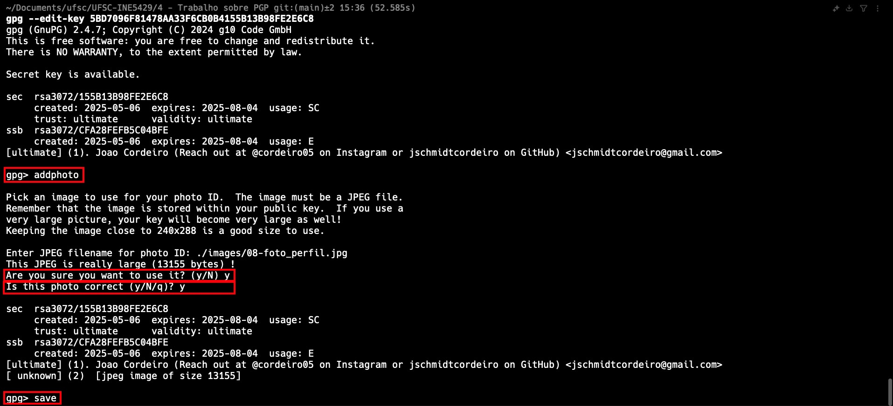

**Verificação da foto no certificado:**
Para confirmar que a foto foi adicionada corretamente ao certificado, executei:

```bash
# Verificação da foto no certificado
gpg --edit-key 5BD7096F81478AA33F6CB0B4155B13B98FE2E6C8
> showphoto
> quit
```

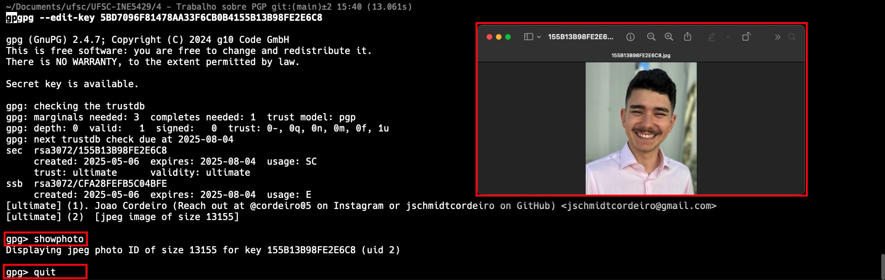

**Observações sobre segurança:**
Adicionar uma foto ao certificado aumenta ligeiramente o tamanho da chave pública e oferece um método visual para confirmar a identidade do proprietário da chave. No entanto, isso também reduz o anonimato, já que qualquer pessoa que tenha acesso à chave pública também terá acesso à imagem. Por isso, é importante escolher uma imagem apropriada e considerar as implicações de privacidade [2].

**Atualização do servidor de chaves:**
Após adicionar a foto, enviei a chave atualizada para o servidor:

```bash
# Enviando a chave atualizada para o servidor
gpg --keyserver keyserver.ubuntu.com --send-key 5BD7096F81478AA33F6CB0B4155B13B98FE2E6C8
```


### 9) O que é preciso para criar e manter um servidor de chaves PGP sincronizado com os demais servidores existentes?

Criar e manter um servidor de chaves PGP sincronizado com a rede global de servidores envolve diversos componentes técnicos, configurações de rede e considerações de infraestrutura [8]. Os servidores de chaves são fundamentais para a infraestrutura de chave pública do OpenPGP, permitindo que os usuários publiquem, descubram e obtenham chaves públicas.

**Requisitos de hardware:**
- Servidor dedicado ou máquina virtual com recursos adequados [9]:
  - CPU: 2-4 núcleos (mais para servidores de alto tráfego)
  - RAM: 4-8 GB mínimo (mais para bancos de dados grandes)
  - Armazenamento: 20-50 GB mínimo, preferencialmente SSD para melhor desempenho
  - Conexão de rede estável e rápida com endereço IP fixo
  - Largura de banda suficiente para lidar com tráfego e sincronização

**Software e configuração:**
- Sistema operacional: Linux (como Debian, Ubuntu Server ou CentOS)
- Software de servidor de chaves (existem algumas opções) [10]:
  - SKS (Synchronizing Key Server) - tradicional, mas com limitações de manutenção
  - Hagrid - mais moderno, usado por keys.openpgp.org
  - OpenPGP CA - para ambientes corporativos
  - pgp-keyserver-lite - implementação mais leve
- Configuração de DNS com registros A e PTR corretamente configurados
- Certificados TLS/SSL para comunicação segura (HTTPS)
- Servidor web como Nginx ou Apache para proxy reverso

**Processo de sincronização:**
1. **Membership**: Configurar o servidor para participar da rede SKS ou equivalente [9]
2. **Peering**: Estabelecer conexões com outros servidores de chaves (peers)
3. **Reconciliação**: Processo pelo qual os servidores trocam informações sobre as chaves que possuem
4. **Recon**: Transferência efetiva de chaves faltantes entre servidores
5. **Programação de sincronização**: Configurar intervalos regulares para sincronização

**Considerações de segurança:**
- Firewall corretamente configurado para permitir apenas tráfego necessário
- Monitoramento de segurança e registro de eventos
- Atualizações regulares de segurança para todos os componentes
- Proteção contra ataques DDoS
- Implementação de mitigações para problemas como "certificate spamming" [11]

**Desafios e problemas conhecidos:**
- **Spam de certificados**: Chaves podem ser "poluídas" com muitas assinaturas [11]
- **Remoção impossível**: Pela natureza descentralizada, chaves são difíceis de remover completamente
- **Requisitos de armazenamento crescentes**: O banco de dados apenas cresce
- **Problemas de privacidade**: Servidores tradicionais expõem todos os detalhes das chaves
- **Manutenção do SKS**: O software tradicional SKS não é mais ativamente mantido [9]

**Abordagens modernas:**
- Servidores como keys.openpgp.org implementam verificação de e-mail [12]
- Algumas implementações modernas permitem remoção de informações pessoais
- Os novos servidores podem optar por filtrar metadados sensíveis
- Rede federada com políticas consensuais entre operadores

**Passos para implementação:**
1. Preparar infraestrutura e instalar sistema operacional
2. Instalar e configurar o software do servidor de chaves [8]
3. Configurar sincronização com outros servidores
4. Configurar certificados TLS/SSL e servidor web
5. Estabelecer políticas de backup e recuperação
6. Configurar monitoramento e alertas
7. Documentar procedimentos operacionais
8. Inscrever-se em listas de discussão relevantes para manter-se atualizado sobre mudanças nos protocolos

A manutenção de um servidor de chaves PGP requer compromisso contínuo, atualizações regulares e monitoramento para garantir que ele continue sendo um recurso confiável e seguro para a comunidade PGP [10].

### 10) Dê um exemplo de como tornar sigiloso um arquivo usando o PGP.

Para demonstrar o processo de tornar um arquivo sigiloso usando o PGP, realizei um experimento de troca de arquivos criptografados com meu colega César Augusto. A comunicação foi feita de forma assíncrona, com cada um de nós criptografando e enviando um arquivo, seguido pela decriptografia do arquivo recebido.

#### Parte 1: Criptografando e enviando um arquivo sigiloso

**1. Preparação do arquivo para envio:**
- Criei um arquivo de texto com informações sensíveis chamado `mensagem_secreta.txt`
- O arquivo continha uma mensagem pessoal que deveria ser lida apenas pelo destinatário

```bash
# Criação do arquivo de exemplo
echo "Esta é uma mensagem secreta para o César Augusto. Só ele deve conseguir ler!" > mensagem_secreta.txt
```

**2. Obtenção da chave pública do destinatário:**
Para criptografar o arquivo, precisei usar a chave pública do destinatário. Como já havia importado a chave do César Augusto em experimentos anteriores, verifiquei se ela ainda estava presente em meu chaveiro:

```bash
# Verificação da chave do César Augusto em meu chaveiro
gpg --list-keys 83501B6CED80BF3E2473308E9915F44F5835C85C
```


**3. Criptografia do arquivo:**
Utilizei a chave pública do destinatário para criptografar o arquivo, garantindo que apenas ele pudesse decifrá-lo com sua chave privada [3]:

```bash
# Criptografia do arquivo usando a chave pública do destinatário
gpg --encrypt --recipient 83501B6CED80BF3E2473308E9915F44F5835C85C --output mensagem_secreta_cesar.txt.gpg mensagem_secreta.txt
```

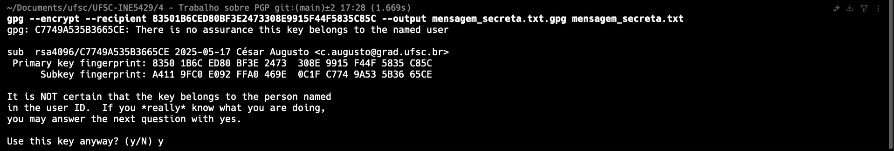

**4. Verificação do arquivo criptografado:**
Após a criptografia, examinei o conteúdo do arquivo criptografado para confirmar que ele estava em formato binário e ilegível:

```bash
# Exibição do conteúdo do arquivo criptografado
hexdump -C mensagem_secreta.txt.gpg | head
```

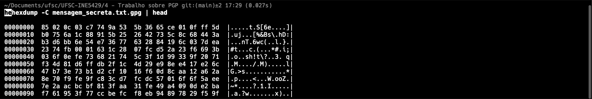

**5. Envio do arquivo criptografado:**
Enviei o arquivo criptografado para o destinatário via WhatsApp. O arquivo poderia ser enviado por qualquer meio, já que seu conteúdo está protegido pela criptografia [2].


#### Parte 2: Recebendo e decifrando um arquivo sigiloso

**6. Recebimento do arquivo criptografado:**
Recebi do César Augusto um arquivo criptografado chamado `mensagem_secreta_joao.txt.gpg`. Este arquivo havia sido criptografado utilizando minha chave pública, de modo que apenas eu poderia decifrá-lo.


**7. Decriptação do arquivo:**
Para decifrar o arquivo, utilizei minha chave privada:

```bash
# Decriptação do arquivo recebido
gpg --decrypt --output mensagem_recebida.txt mensagem_secreta_joao.txt.gpg
```

Durante o processo, o sistema solicitou a senha da minha chave privada para autorizar a decriptação.


**8. Verificação do conteúdo original:**
Após a decriptação, pude verificar o conteúdo original do arquivo:

```bash
# Visualização do conteúdo decifrado
cat mensagem_recebida.txt
```


#### Resultados e observações

Este experimento demonstrou com sucesso o processo de proteção de arquivos sensíveis usando criptografia assimétrica PGP. Pontos importantes a serem destacados [4]:

1. **Segurança assimétrica:** Apenas o possuidor da chave privada correspondente pode decifrar um arquivo criptografado com uma chave pública
2. **Praticidade:** A criptografia PGP integra-se bem aos fluxos de trabalho existentes
3. **Versatilidade:** Qualquer tipo de arquivo pode ser protegido, não apenas mensagens de texto
4. **Comunicação segura:** Nenhum meio de comunicação seguro foi necessário para o transporte do arquivo

Estes procedimentos podem ser aplicados a qualquer tipo de arquivo que necessite de confidencialidade, como documentos sensíveis, backups pessoais, ou comunicações privadas. A chave para a segurança do sistema é a proteção adequada da chave privada, que nunca deve ser compartilhada e deve ser protegida por uma senha forte [2].

### 11) Mostre um exemplo de como assinar um arquivo (assinatura anexada e outro com assinatura separada ), usando o PGP. Envie uma mensagem assinada para um colega. Esse colega deve enviar para você outra mensagem assinada. Verifique se a assinatura está correta.

Para demonstrar o processo de assinatura digital utilizando o PGP, realizei dois tipos de assinatura em arquivos: uma com assinatura anexada (inline) e outra com assinatura separada (detached). Em seguida, troquei mensagens assinadas com o mesmo colega, Enzo Nicolas, para validar o processo de verificação de assinaturas [1].

#### Parte 1: Criação de assinaturas digitais

A assinatura digital serve para garantir a autenticidade e integridade de um arquivo - confirmando que ele foi criado por quem afirma tê-lo criado e que não foi modificado desde então [3].

**1. Preparação dos arquivos para assinar:**

Criei dois arquivos de texto simples para serem assinados:

```bash
# Criação do primeiro arquivo para assinatura anexada
echo "Este é um documento importante que precisa ser assinado para comprovar sua autenticidade. Esta assinatura será anexada ao conteúdo original." > files/documento_assinatura_anexada.txt

# Criação do segundo arquivo para assinatura separada
echo "Este é outro documento importante que será assinado digitalmente. Esta assinatura será mantida em um arquivo separado." > files/documento_assinatura_separada.txt
```

**2. Criação de assinatura anexada (inline):**

Neste método, o conteúdo original e a assinatura são combinados em um único arquivo:

```bash
# Assinatura anexada
gpg --sign --output files/documento_assinado.txt.gpg files/documento_assinatura_anexada.txt
```


O arquivo resultante (`documento_assinado.txt.gpg`) contém tanto o conteúdo original quanto a assinatura, mas em formato binário.

**3. Criação de assinatura separada (detached):**

Neste método, a assinatura é armazenada em um arquivo separado, mantendo o arquivo original intacto:

```bash
# Assinatura separada
gpg --detach-sign files/documento_assinatura_separada.txt
```


O comando gera um arquivo de assinatura chamado `documento_assinatura_separada.txt.sig`, enquanto o arquivo original permanece inalterado.

**4. Verificação local das assinaturas:**

Antes de enviar as assinaturas, verifiquei localmente se estavam funcionando corretamente:

```bash
# Verificação da assinatura anexada
gpg --decrypt files/documento_assinado.txt.gpg

# Verificação da assinatura separada
gpg --verify files/documento_assinatura_separada.txt.sig files/documento_assinatura_separada.txt
```

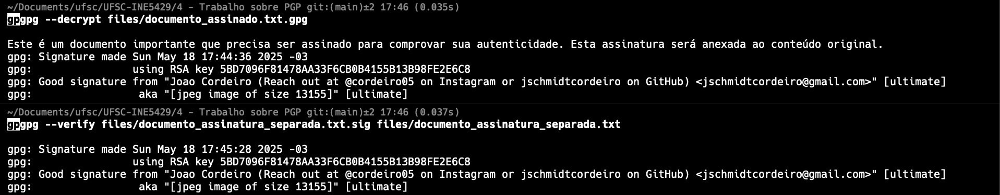

#### Parte 2: Troca de arquivos assinados com um colega

**5. Envio dos arquivos assinados:**

Enviei para o César Augusto os seguintes arquivos:
- Para a assinatura anexada: apenas o arquivo `documento_assinado.txt.gpg`
- Para a assinatura separada: tanto o arquivo original `documento_assinatura_separada.txt` quanto a assinatura `documento_assinatura_separada.txt.sig`

```bash
# Compactação dos arquivos para envio
zip files/arquivos_assinados.zip files/documento_assinado.txt.gpg files/documento_assinatura_separada.txt files/documento_assinatura_separada.txt.sig
```


**6. Recebimento de arquivos assinados:**

Recebi do César Augusto os arquivos correspondentes:
- Um arquivo com assinatura anexada: `files/arquivo_assinado.txt.gpg`
- Um arquivo original e sua assinatura separada: `files/arquivo_assinado.txt` e `files/arquivo_assinado.txt.sig`


#### Parte 3: Verificação das assinaturas recebidas

**7. Verificação da assinatura anexada:**

Para verificar a assinatura anexada, utilizei o comando de decriptação do GPG, que também verifica a assinatura:

```bash
# Verificação da assinatura anexada e extração do conteúdo
gpg --decrypt files/arquivo_assinado.txt.gpg > files/arquivo_anexado_conteudo.txt
```

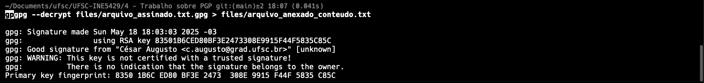

**8. Verificação da assinatura separada:**

Para a assinatura separada, utilizei o comando específico de verificação:

```bash
# Verificação da assinatura separada
gpg --verify files/arquivo_assinado.txt.sig files/arquivo_assinado.txt
```


**9. Inspeção do conteúdo das mensagens:**

Após confirmar a autenticidade das assinaturas, pude visualizar o conteúdo das mensagens com segurança:

```bash
# Visualização do conteúdo da mensagem com assinatura anexada
cat files/arquivo_anexado_conteudo.txt

# Visualização do conteúdo da mensagem com assinatura separada
cat files/arquivo_assinado.txt
```

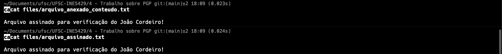

#### Resultados e observações

Este experimento demonstrou com sucesso o processo de assinatura digital e verificação utilizando o PGP [1]. Pontos importantes:

1. **Integridade garantida:** Qualquer alteração no conteúdo original invalidaria a assinatura
2. **Autenticidade confirmada:** A verificação bem-sucedida comprova que o arquivo foi realmente assinado pelo remetente
3. **Diferenças entre os métodos:**
   - **Assinatura anexada:** Conveniente por manter tudo em um arquivo, mas modifica o formato original
   - **Assinatura separada:** Mantém o arquivo original intacto, ideal para documentos que não devem ser modificados

Ambos os métodos são eficazes para garantir a autenticidade e integridade das comunicações digitais. A escolha entre eles depende dos requisitos específicos de cada situação [2].

## Referências
1. The GNU Privacy Guard Manual - Key Signing. Disponível em: <https://www.gnupg.org/gph/en/manual/x334.html>
2. OpenPGP Best Practices. Disponível em: <https://riseup.net/en/security/message-security/openpgp/best-practices>
3. RFC 4880, Section 5.2.1: Signature Revocation. Disponível em: <https://datatracker.ietf.org/doc/html/rfc4880#section-5.2.1>
4. GnuPG Privacy Handbook - Managing your keys. Disponível em: <https://www.gnupg.org/gph/en/manual/c481.html>
5. GnuPG Documentation - Private Keyring. Disponível em: <https://www.gnupg.org/documentation/manuals/gnupg/Private-Keys.html>
6. GnuPG Documentation - Local vs. Exportable Signatures. Disponível em: <https://www.gnupg.org/documentation/manuals/gnupg/GPG-Options.html>
7. The Web of Trust. Disponível em: <https://www.gnupg.org/gph/en/manual/x547.html>
8. Koch, W. (2018). "GnuPG and OpenPGP Keyservers." Disponível em: <https://gnupg.org/blog/20190514-keyserver-problems.html>
9. SKS Keyserver Documentation. Disponível em: <https://bitbucket.org/skskeyserver/sks-keyserver/wiki/Home>
10. Fiskerstrand, K. (2019). "OpenPGP Key Server Administration Guide." Disponível em: <https://keyserver.mattrude.com/guides/building-server/>
11. "Certificate Poisoning in the SKS Keyservers." Disponível em: <https://gist.github.com/rjhansen/67ab921ffb4084c865b3618d6955275f>
12. "Keys.openpgp.org: A modern keyserver." Disponível em: <https://keys.openpgp.org/about>